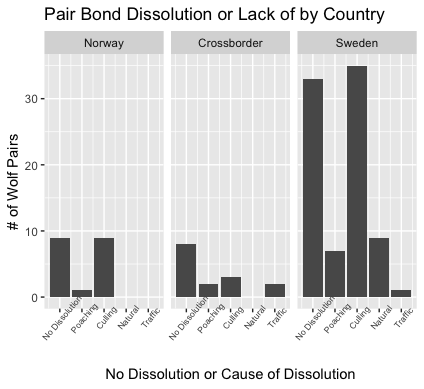

# Mate for life

## Biological Question
1. Are there any correlations between the cause of dissolution or lack of dissolution in wolf pair bonds and the duration of the pair bond?
2.  Are there any correlations between the cause of dissolution or lack of dissolution and the country the wolves were being tracked in? 

## Context
Monogamy is rare in the animal kingdom. Wolves are one species that create these life long bonds. They are also pack animals. Dissolutions of pair bonds could have important consequences on pack and population dynamics. Especially as wolf reintroductions increase, it is important to have a better understanding of these bonds, and how much they are being impacted by humans and human activity. 

## Methods
##### *The source of the data*
Milleret et al. (2016) tracked wolf pair bonds in a recolonizing population in Scandinavia over the course of 14 winters. They looked to find the extrinsic and intrinsic factors that lead to pair bond dissolution. Milleret et al. (2016) predicted  most pair dissolutions would be due to human related factors and would result in shorter pair bond durations.  

##### Citations
Original publication: 
Milleret C, Wabakken P, Liberg O, Åkesson M, Flagstad Ø, Andreassen HP, Sand H (2016) Let's stay together? Intrinsic and extrinsic factors involved in pair bond dissolution in a recolonizing wolf population. Journal of Animal Ecology 86(1): 43-54. [https://doi.org/10.1111/1365-2656.12587](https://doi.org/10.1111/1365-2656.12587)
Data archive: 
Milleret C, Wabakken P, Liberg O, Åkesson M, Flagstad Ø, Andreassen HP, Sand H (2016) Data from: Let’s stay together? Intrinsic and extrinsic factors involved in pair bond dissolution in a recolonizing wolf population. Dryad Digital Repository. [https://doi.org/10.5061/dryad.242t8](https://doi.org/10.5061/dryad.242t8)

##### *How the data was produced*
The researchers tracked 153 wolf pairs in a reintroduced population in Norway, Sweden and the cross border between them for 14 winters using snow tracking and DNA monitoring (Milleret, 2016). Because it was a reintroduced population, they had an extensive DNA profile to work with. The wolf pairs and their territories were identified. As the wolves were tracked, many other factors were recorded, such as the density of road, humans, and moose in each pair bonds territory. These provided more information on the extrinsic factors that could potentially lead to death of one or both wolves in a pair bond. The age and potential offspring inbreeding coefficient of the pairs were also recorded every winter. These provided more information on the intrinsic causes of death. 

The raw data is a 64195 Mb data frame consisting of 18 columns and 369 rows all with numeric values. Only 153 wolf pairs were tracked, but each pair can have more than one row assigned to them with various different information as they were tracked through several winters. This presented a challenge when subsetting the data because I needed a single row of data for each wolf pair and it was usually the last entry for each wolf pair.  

##### *What the original authors did with the data*
The original study sought to investigate the main causes of wolf pair bond dissolutions. Through this main goal, the researchers were also able to calculate the median time of pair bond duration.  All observed dissolutions with identified causes were due to the death or one or both wolves. They then broke down the percentage of deaths due to human caused factors compared to natural causes such as disease and age. They were not able to determine cause for all the deaths accounted but they provide their hypothesis on those deaths and give other possible factors that they observed that could increase the risk of pair bond dissolution (Milleret, 2016).

##### *What I did with the data and how I did it*
I first looked to find correlations between the cause of dissolution or lack of dissolution and the duration of the wolf pair bond. I began by using the dplyr package to create a new data frame that included only the columns I needed, and allowed me to have only the final entry for every wolf pair. I subsetted the entries that had event = 0 because those were 'censored' which meant the event of interested had not occurred. I removed those entries. Then using ggplot I created 5 bar plots displaying the duration of pair bonds subsetted by the the cause of death or lack of dissolution using facet_wrap. I then wanted to show the average duration of each of the five categories so I went through each category and indexed into the vectors that contained only the entries I wanted and found the mean of the vectors. Then, I plotted those five points onto a plot, removed the axis and replaced it with labels that were more informative. 

My second question was about the correlation between cause of death or lack of and the country the wolves were being tracked in. I followed the same process as for my first question, keeping only the columns I needed and removing the censored. Again using ggplot I created three bar plots facetted by country. I tried different things to try to make it look nicer, and I was unable to get each of the five categories to be a different color in order to have a legend. Instead I renamed the tick labels like I did for the plot with the average durations. 

## Results and Conclusion 

It was hard to find general patterns like the ones I initially predicted to find. It is a pretty small sample size, but it is understandable because of the amount of effort, resources, and time that have to go into this type of tracking. It's evident that the human caused deaths are extremely disruptive of young pair bonds. The averages plot doesn't show any particular trend, but it makes sense that no dissolutions and natural causes have higher pair bond durations. It's interesting that poaching has the highest average duration. 

These plots are very interesting. It may have to do with the size of the areas in each country the wolves were tracked in, but Sweden has a much higher proportion of wolves in general but also of deaths due to culling. Even so, it seems culling is pretty common in both countries. It would be cool to see what the underlying attitudes towards wolves are in each country and if they have shifted over time. 
