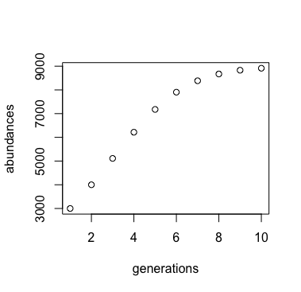

### Lab 8: Logistic Growth Model

The logistic growth model is an equation that predicts the abundance of a population at any given time or generation based on the abundance during the last generation, the growth rate and the carrying capacity. 

#### Lines 2-19:
These lines are an identical copy of the code I wrote for my script in Lab 4. I kept it in and left it unchanged so I could reference it as needed. 

#### Lines 21-31:
These 10 lines are the creation of the logistic growth model into a function that also makes a plot and matrix of the data output. 
To call the function you must provide `r` (the intrinsic growth rate), `k` (the carrying capacity), `initialN` (initial population size), and `totGens` (the number of generations). 

##### Lines 22-26:
These lines are the lines used in my original code with some changed variables so that there are _no_ magic numbers. This is what produces the logistic growth model of whatever arguments its given.

##### Lines 27-28:
These two lines create a plot of the data generated from the for loop above it. 

 

##### Lines 29-30:
These lines create a matrix of the data from the for loop and `return(abundMatrix)` gives you that matrix in the console when the `logGrowthModel` function is used. 

This is everything that is encapsulated inside of the `logGrowthModel`

#### Lines 33-41:
* Lines 34 and 37 are testing out the `logGrowthModel` with 2 sets of different arguments, the first using parameters where I knew beforehand what the results should be. 
* Lines 40-41 store the matrix given when the `logGrowthModel` is called and then turns it into a csv file and saves it into your working directory. 

